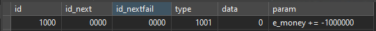

# 🧠 Eudemons Online `cq_action` Table Guide

Welcome to the ultimate guide for understanding the `cq_action` table used in Eudemons Online private servers. This table plays a critical role in controlling game behavior — from NPC dialogs and item rewards to experience gains, system messages, and conditional logic.

Whether you're new to EO development or looking to refine your scripting skills, this guide will walk you through:
- The purpose and structure of the `cq_action` table
- Common `type` codes and how they work
- Practical examples like giving items, showing NPC dialogs, and triggering system messages
- Tips for chaining actions using `id_next` and handling conditions with `id_nextfail`

All content is written clearly and includes real-world examples to help you build, debug, and expand your server’s functionality faster.

> ⚙️ Built by the EO dev community — for the EO dev community.

Explore the sections below and level up your EO server customization!

- [What is `cq_action`?](#what-is-cq_action)
- [Field Explanations](#field-explanations)
- [Common Action Types](#common-action-types)
- [Type Explaination Download](#download-full-action-types)
- [Action Type Guides](#action-type-guides)

---

## What is `cq_action`?



The `cq_action` table controls sequences of actions triggered in-game — like when you click an NPC, receive an item, or complete a quest. It uses an ID-based flow system with support for conditions and multiple outcomes.

---

## Field Explanations


>```INSERT INTO `cq_action` (`id`, `id_next`, `id_nextfail`, `type`, `data`, `param`) VALUES (1000, 0000, 0000, 0501, 810007, '');```

| Field         | Description |
|---------------|-------------|
| `id`          | Unique action ID |
| `id_next`     | Next action if success/condition true |
| `id_nextfail` | Next action if condition fails |
| `type`        | Type of action (dialog, give item, etc.) |
| `data`        | Depends on type (item ID, message ID, etc.) |
| `param`       | Usually contains message text or command |

---

## Common Action Types

| Type Code | Description                  |
|-----------|------------------------------|
| `0101`    | NPC Dialog Text              |
| `0102`    | NPC Options (buttons)        |
| `0125`    | System Announcement (Global) |
| `0126`    | System Tip (Local)           |
| `501`     | Give Item                    |
| `1001`    | Give EXP, Money, Stones      |

---


## Download Full Action Types

You can download the full explanation of action types here.

- [Download Here](assets/ScriptTypeExplanation.txt)

---


## Action Type Guides

<div style="border-left: 4px solid #4CAF50; background: #e8f5e9; padding: 10px; margin: 10px 0;">
  <strong>✅ Tip:</strong> Helpful advice for doing things better or more easily.
</div>


<!-- Stylish Button to trigger popup -->
<button onclick="document.getElementById('popup101').style.display='block'" 
        style="background-color: #4CAF50; color: white; padding: 12px 24px; font-size: 16px; font-weight: bold; border: none; border-radius: 8px; box-shadow: 0 4px 8px rgba(0,0,0,0.2); cursor: pointer; transition: all 0.3s ease;">
  🗨️ Create Dialog (Type 101)
</button>

<!-- Extra-Wide Popup Modal -->
<div id="popup101" style="display:none; position:fixed; z-index:1000; top:0; left:0; width:100%; height:100%; background-color:rgba(0,0,0,0.6);">
  <div style="background:white; padding:40px; max-width:1100px; width:95%; margin:4% auto; border-radius:14px; position:relative; box-shadow:0 0 20px rgba(0,0,0,0.35); font-family:sans-serif;">
    
    <!-- Close Button -->
    <span onclick="document.getElementById('popup101').style.display='none'" 
          style="position:absolute; top:15px; right:25px; font-size:28px; font-weight:bold; cursor:pointer;">&times;</span>
    
    <!-- Popup Content -->
    <h2 style="margin-top:0;">🗨️ Type 101 - Create Dialog</h2>
    <p style="font-size:1.1rem;">This action shows a dialog when the player interacts with an NPC or Items.</p>

    <h4 style="margin-bottom:5px;">💡 Example SQL:</h4>
    <div style="background:#f4f4f4; border-radius:8px; padding:12px 16px; font-size:14px; line-height:1.4; overflow:auto; max-height:220px;">
      <pre style="margin:0; white-space:pre-wrap;"><code>
    REPLACE INTO `cq_action` VALUES (6960043, 6960044, 0000, 0101, 0, 'But I can sell it only for an hour every day.');
    REPLACE INTO `cq_action` VALUES (6960044, 6960045, 0000, 0101, 0, 'Do you want to give it a go?');
    REPLACE INTO `cq_action` VALUES (6960045, 6960046, 0000, 0102, 0, 'Just~one,~please. 6960060');
    REPLACE INTO `cq_action` VALUES (6960046, 4000035, 0000, 0102, 0, 'Sorry,~but~I~don`t~need~it. 0');
      </code></pre>
    </div>


    <ul style="margin-top:20px; font-size:15px;">
      <li><code>type</code> = 101</li>
      <li><code>param</code> = NPC dialog text</li>
      <li>You can chain it with <code>id_next</code></li>
    </ul>
  </div>
</div>


 - [Create Dialog](type/101.md)
 - [Type : 200 - 299](type/101.md)
 - [Type : 300 - 399](type/101.md)
 - [Type : 400 - 499](type/101.md)
 - [Type : 500 - 599](type/101.md)
 - [Type : 600 - 699](type/101.md)
 - [Type : 700 - 799](type/101.md)
 - [Type : 800 - 899](type/101.md)
 - [Type : 1000 - 1099](type/101.md)
 - [Type : 1100 - 1199](type/101.md)
 - [Type : 5001 (VIP)](type/101.md)
 - [Type : 1500 - 1599](type/101.md)
 - [Type : 2000 - 2099](type/101.md)
 - [Type : 2100 - 2199](type/101.md)
 - [Type : 3000 - 3099](type/101.md)
 - [Type : 4000 - 4099](type/101.md)
 - [Type : 8000 - 8099](type/101.md)

  - [Color Font Generator](color-generator.html)

