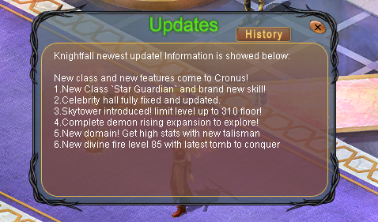
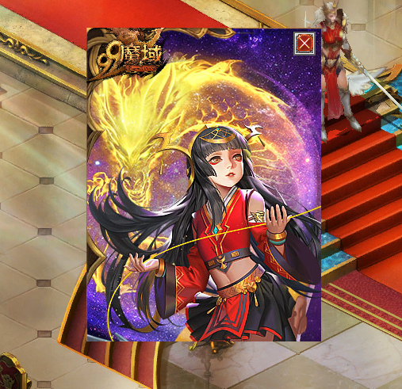

# 🧠 Eudemons Online `cq_action` Table Guide

Welcome to the ultimate guide for understanding the `cq_action` table used in Eudemons Online private servers. This table plays a critical role in controlling game behavior — from NPC dialogs and item rewards to experience gains, system messages, and conditional logic.

Whether you're new to EO development or looking to refine your scripting skills, this guide will walk you through:
- The purpose and structure of the `cq_action` table
- Common `type` codes and how they work
- Practical examples like giving items, showing NPC dialogs, and triggering system messages
- Tips for chaining actions using `id_next` and handling conditions with `id_nextfail`

All content is written clearly and includes real-world examples to help you build, debug, and expand your server’s functionality faster.

> ⚙️ Built by the EO dev community — for the EO dev community.

Explore the sections below and level up your EO server customization!

- [What is `cq_action`?](#what-is-cq_action)
- [Field Explanations](#field-explanations)
- [Common Action Types](#common-action-types)
- [Type Explaination Download](#download-full-action-types)
- [Action Type Guides](#action-type-guides)
- [Other Tools](#other-tools)

---

## What is `cq_action`?


The `cq_action` table controls sequences of actions triggered in-game — like when you click an NPC, receive an item, or complete a quest. It uses an ID-based flow system with support for conditions and multiple outcomes.

---

## Field Explanations


>```INSERT INTO `cq_action` (`id`, `id_next`, `id_nextfail`, `type`, `data`, `param`) VALUES (1000, 0000, 0000, 0501, 810007, '');```

| Field         | Description |
|---------------|-------------|
| `id`          | Unique action ID |
| `id_next`     | Next action if success/condition true |
| `id_nextfail` | Next action if condition fails |
| `type`        | Type of action (dialog, give item, etc.) |
| `data`        | Depends on type (item ID, message ID, etc.) |
| `param`       | Usually contains message text or command |

---

## Common Action Types

| Type Code | Description                  |
|-----------|------------------------------|
| `0101`    | NPC Dialog Text              |
| `0102`    | NPC Options (buttons)        |
| `0125`    | System Announcement (Global) |
| `0126`    | System Tip (Local)           |
| `501`     | Give Item                    |
| `1001`    | Give EXP, Money, Stones      |

---


## Download Full Action Types

You can download the full explanation of action types here.

- [Download Here](assets/ScriptTypeExplanation.txt)

---


## Action Type Guides

<div style="border-left: 6px solid #4CAF50; background: #f0fdf4; padding: 15px 20px; margin: 20px 0; border-radius: 6px; font-size: 15px; line-height: 1.6;">
  <strong style="display: inline-block; margin-bottom: 6px;">✅ Tip:</strong><br>
  <strong>Old Engine</strong> = 3-class system (2008)<br>
  ➤ Reference: 
  <a href="https://www.elitepvpers.com/forum/eo-pserver-guides-releases/191378-release-manequin-english-server-db-client-ready-use-one-link.html" target="_blank" style="color:#2e7d32; text-decoration:underline;">
    2008 Release (Mannequin DB)
  </a>
  <br><br>
  <strong>New Engine</strong> = 9-class system with new features (2022)<br>
  ➤ Reference:
  <a href="https://www.elitepvpers.com/forum/eo-pserver-guides-releases/5076188-release-version-1655-engine-celebrity-hall-divine-fire-statue.html" target="_blank" style="color:#2e7d32; text-decoration:underline;">
    2022 Release (v1655 Engine)
  </a>
</div>


<details>
  <summary>🗨️ <strong>Create Dialog (Type 101, 102, 104 and 120)</strong></summary>
  <br>

  <p>This action shows a dialog when the player interacts with an NPC or item.</p>
  

  <h4>💡 Example SQL:</h4>
  <pre>
REPLACE INTO `cq_action` VALUES (1001, 1002, 0000, 0101, 0, 'I can sell it only for an hour every day.');
REPLACE INTO `cq_action` VALUES (1002, 1003, 0000, 0101, 0, 'Do you want to give it a go?');
REPLACE INTO `cq_action` VALUES (1003, 1004, 0000, 0102, 0, 'Just~one,~please. 1007');
REPLACE INTO `cq_action` VALUES (1004, 1005, 0000, 0102, 0, 'Sorry,~but~I~dont~need~it. 0');
REPLACE INTO `cq_action` VALUES (1005, 1006, 0000, 0104, 0, '0 0 34');
REPLACE INTO `cq_action` VALUES (1006, 0000, 0000, 0120, 0, '');
  </pre>

  <h4>🧾 Required Task Entries (cq_task)</h4>
  <pre>
REPLACE INTO `cq_task` VALUES (1001, 1001, 0000, '', '', 0, 0, 999, -100000, 100000, 0999, 0000, 0, -1, 0);
REPLACE INTO `cq_task` VALUES (1007, 1007, 0000, '', '', 0, 0, 999, -100000, 100000, 0999, 0000, 0, -1, 0);
  </pre>

  <h4>📘 Explanation Table:</h4>
  <table style="width:100%; border-collapse:collapse;">
    <thead>
      <tr style="background:#f0f0f0;">
        <th style="text-align:left; padding:8px; border-bottom:1px solid #ccc;">Type</th>
        <th style="text-align:left; padding:8px; border-bottom:1px solid #ccc;">Purpose</th>
        <th style="text-align:left; padding:8px; border-bottom:1px solid #ccc;">param Explanation</th>
      </tr>
    </thead>
    <tbody>
      <tr>
        <td style="padding:8px;"><code>101</code></td>
        <td style="padding:8px;">Show dialog text</td>
        <td style="padding:8px;">NPC or item dialog string (≈ 40–45 chars per line)</td>
      </tr>
      <tr>
        <td style="padding:8px;"><code>102</code></td>
        <td style="padding:8px;">Dialog options / buttons</td>
        <td style="padding:8px;">Text ~ spacing + task_id (use <code>0</code> for close)</td>
      </tr>
      <tr>
        <td style="padding:8px;"><code>104</code></td>
        <td style="padding:8px;">Dialog face image</td>
        <td style="padding:8px;">x y pic_id — from Ani/NpcFace.ANI (e.g. Face34)</td>
      </tr>
      <tr>
        <td style="padding:8px;"><code>120</code></td>
        <td style="padding:8px;">End of dialog</td>
        <td style="padding:8px;">(none)</td>
      </tr>
    </tbody>
  </table>

  <h4>💡 Tips:</h4>
  <ul>
    <li>Every <code>type 101</code> must have a corresponding <code>cq_task</code> entry</li>
    <li>Every <code>task_id</code> used in <code>type 102</code> must also exist in <code>cq_task</code></li>
    <li>Use <code>~</code> for spacing inside all dialog text and option strings</li>
    <li>Use <code>0104</code> to show NPC face image (optional)</li>
    <li>End your dialog with <code>0120</code> to ensure it closes cleanly</li>
  </ul>

  <div style="border-left: 4px solid #2196f3; background: #e3f2fd; padding: 12px 16px; margin-top: 16px; border-radius: 6px;">
    🔧 <strong>Reminder:</strong> If the dialog doesn't show or options do nothing, double check your <code>cq_task</code> entries!
  </div>
</details>


<details>
  <summary>💠 <strong>Modern NPC Dialog (Type 132 & 133)</strong></summary>
  <br>

  <p>This dialog system creates stylish, story-driven NPC interactions with portrait images, background panels, and up to 4 interactive options.This feature is only available on the 🆕 New Engine.</p>

  <div style="background:#fff8e1; border-left:4px solid #FFC107; padding:12px 16px; margin-bottom:16px; border-radius:6px;">
    ⚠️ <strong>New Engine Only</strong><br>
    This feature does not exist in classic (old) engine clients.
  </div>

  <h4>🖼️ Example: Linleria Dialog</h4>
  


  <h4>📜 Linleria SQL</h4>
  <pre>
REPLACE INTO cq_action VALUES (1001, 1002, 0000, 0101, 0, 'Hello~i`am~Linleria~the~designer,~do~you~have~enough~essence~to~trade~off~with~these~cosmetic~items?');
REPLACE INTO cq_action VALUES (1002, 1003, 0000, 0102, 0, 'Yes,send~me~there. 1006');
REPLACE INTO cq_action VALUES (1003, 1004, 0000, 0102, 0, 'Close. 1005');
REPLACE INTO cq_action VALUES (1004, 0000, 0000, 0132, 0, '0 Tasksystem_GeneralbotPic Linleria 0 Tasksystem_WnbeishangPic');
REPLACE INTO cq_action VALUES (1005, 0000, 0000, 133, 0, '');
  </pre>

  <ul>
    <li><strong>`Linleria`</strong>: Displayed name (customizable)</li>
    <li><strong>`Tasksystem_GeneralbotPic`</strong>: Dialog background (default, don’t change)</li>
    <li><strong>`Tasksystem_WnbeishangPic`</strong>: Portrait image (can change, from control.ani)</li>
    <li>Image preview path: <code>data/interface/style01/Tasksystem/God/WnbeishangPic.dds</code></li>
  </ul>

  <h4>🖼️ Example: Skuld Dialog</h4>
  

  <h4>📜 Skuld SQL</h4>
  <pre>
REPLACE INTO cq_action VALUES (1001, 1002, 0000, 0101, 0, 'Do~You~see~the~Sword~there?~This~sword~is~belong~to~King~of~the~Four~Seas.~I~need~your~help~to~stop~him. sound/dice_move.wav');
REPLACE INTO cq_action VALUES (1002, 1003, 0000, 0102, 0, 'I~am~going~to~absorb~the~energy. 1006');
REPLACE INTO cq_action VALUES (1003, 1004, 0000, 0102, 0, 'Close. 1005');
REPLACE INTO cq_action VALUES (1004, 0000, 0000, 0132, 0, 'Novice_BottomBG Novice_RolePic 21650');
REPLACE INTO cq_action VALUES (1005, 0000, 0000, 0133, 2, '');
  </pre>

  <ul>
    <li><strong>`Novice_BottomBG`</strong>: Background (default)</li>
    <li><strong>`Novice_RolePic`</strong>: NPC portrait name (can change, from control.ani)</li>
    <li>Image preview path: <code>data/interface/style01/Rookie/RolePic.dds</code></li>
    <li><strong>`21650`</strong>: NPC label ID (used for Skuld style)</li>
  </ul>

  <h4>⚠️ Important Notes</h4>
  <ul>
    <li><strong>Maximum 4 options</strong> (<code>0102</code>) per dialog</li>
    <li>One option <strong>must be a Close</strong> (linked to <code>type 133</code>)</li>
    <li><strong>Use <code>~</code> instead of spaces</strong> in all dialog lines or they won't display!</li>
    <li><code>Type 132</code> requires the player to be very close to the NPC (within ~5 tiles)</li>
    <li><strong>An NPC object is required</strong> — dialog won’t trigger if no valid NPC is nearby</li>
    <li><code>type 133</code> must use <code>data = 2</code> to allow proper closing for some UIs</li>
    <li>Supports ambient sound: add file at end of <code>param</code> like <code>sound/dice_move.wav</code> (Skuld dialog only!)</li>
  </ul>

  <div style="border-left: 4px solid #4CAF50; background: #e8f5e9; padding: 12px 16px; margin-top: 16px; border-radius: 6px;">
    💡 <strong>Tip:</strong> All dialog lines and button text must use <code>~</code> instead of spaces. Example:<br>
    <code>Hello~brave~warrior!</code> ✅ &nbsp;&nbsp;&nbsp;&nbsp; <code>Hello brave warrior!</code> ❌
  </div>

</details>


<details>
  <summary>🎁 <strong>Sent Items (Type 501, 525, 540, 550)</strong></summary>
  <br>

  <p>Sends specific items to the player when triggered. Used for quest rewards, shop systems, monster drops, and more.</p>


  <h4>📜 Basic Example – Type 501 (Give Item)</h4>
  <pre>
-- Give 1 item (basic)
REPLACE INTO cq_action VALUES (1000, 1002134, 0000, 0501, 754826, '');
  </pre>


  <h4>📜 Custom Stats – Type 501</h4>
  <pre>
-- With custom stats (Old Engine)
REPLACE INTO cq_action VALUES (1000, 0000, 0000, 0501, 1081990, '0 0 0 0 0 0 0 0 0 0 0 0 1');

-- Old Engine Params:
amount amount_limit ident gem1 gem2 magic1 magic2 magic3 data warghostexp gemtype availabletime MONOPOLY
  </pre>

  <pre>
-- With custom stats (New Engine)
REPLACE INTO cq_action VALUES (1000, 0000, 0000, 0501, 1081990, '0 0 0 0 0 0 0 0 0 0 0 0 1 0 0 0 0 0 0 0 0');

-- New Engine Params:
amount amount_limit ident gem1 gem2 magic1 magic2 magic3 data warghostexp gemtype availabletime MONOPOLY
eudemon_attack1 eudemon_attack2 eudemon_attack3 eudemon_attack4 special_effect Gem3 GodExp prescription
  </pre>


  <h4>📌 Special Variants:</h4>

  <pre>
-- Type 525 (New Engine Only): Same as 501 but "availabletime" becomes "aging days"
REPLACE INTO cq_action VALUES (1000, 0000, 0000, 0525, 820646, '0 0 0 0 0 0 0 0 0 0 0 30');
-- 30 = 30 days
  </pre>

  <pre>
-- Type 540 (Both Engines): Modifies stackable item count
REPLACE INTO cq_action VALUES (1000, 0000, 0000, 0540, 1020171, 'amount += 1');

-- Notes:
Supports: +=, -=, =, >, <, >=, <=
Can also be used to remove items: 'amount += -1'
Only works for stackable items
Recommended for adjusting count instead of deleting via 502
  </pre>

  <pre>
-- Type 550 (New Engine Only): Same as 501 but with client-side display effect
REPLACE INTO cq_action VALUES (1000, 0000, 0000, 0550, 1600261, '');
  </pre>

  


  <h4>💡 Tips:</h4>
  <ul>
    <li>Use <code>type 503</code> to check item count before giving or removing</li>
    <li><code>540</code> is more flexible and safer than deleting stackable items with <code>502</code></li>
    <li>To show visual reward feedback, use <code>550</code> (New Engine only)</li>
    <li><code>525</code> is useful for timed items like trial gear or events</li>
  </ul>

  <div style="border-left: 4px solid #4CAF50; background: #e8f5e9; padding: 12px 16px; margin-top: 16px; border-radius: 6px;">
    ✅ <strong>Type 540 works in both Old and New Engine</strong>. Use it for adjusting stackable item amounts, both add and subtract.
  </div>
</details>


<details>
  <summary>🗑️ <strong>Delete Item (Type 502)</strong></summary>
  <br>

  <p><strong>Type 502</strong> is used to remove one or more items from the player’s inventory based on type or name.</p>


  <h4>📦 Syntax Behavior</h4>
  <ul>
    <li><code>data</code> = <strong>ItemTypeID</strong> (or <code>0</code> to match by name)</li>
    <li><code>param</code> = quantity or item name (if using <code>data = 0</code>)</li>
    <li>Use <code>id_nextfail</code> to handle missing items or not enough quantity</li>
  </ul>


  <h4>📜 Example: Delete Single Quantity by Item Type</h4>
  <pre>
REPLACE INTO cq_action VALUES (1001, 1003, 1002, 0502, 1020030, '1 1');
REPLACE INTO cq_action VALUES (1002, 0000, 0000, 0126, 0, 'You don`t have enough item.');
  </pre>


  <h4>📜 Example: Delete Stack of Items</h4>
  <pre>
REPLACE INTO cq_action VALUES (1001, 1003, 1002, 0502, 810002, '10');
REPLACE INTO cq_action VALUES (1002, 0000, 0000, 0126, 0, 'You don`t have enough item.');
  </pre>


  <h4>📜 Example: Delete Unstackable Items (Repeat Action)</h4>
  <pre>
-- Delete 2x [ItemID: 111006] if item is NOT stackable
REPLACE INTO cq_action VALUES (1001, 1002, 1003, 0502, 111006, 0);
REPLACE INTO cq_action VALUES (1002, 1004, 1003, 0502, 111006, 0);
REPLACE INTO cq_action VALUES (1003, 0000, 0000, 0126, 0, 'You don`t have enough item.');
  </pre>


  <h4>📜 Example: Delete Items by Name</h4>
  <pre>
-- Delete 2x "Blue Crest Helmet" by item name
REPLACE INTO cq_action VALUES (1001, 1002, 1003, 0502, 0, 'Blue~Crest~Helmet');
REPLACE INTO cq_action VALUES (1002, 1004, 1003, 0502, 0, 'Blue~Crest~Helmet');
REPLACE INTO cq_action VALUES (1003, 0000, 0000, 0126, 0, 'You don`t have enough item.');
  </pre>


  <h4>✅ For Stack Items: Use <code>Type 540</code> (Recommended)</h4>
  <pre>
-- Safely subtract 5x stackable item (e.g., EXP Scroll)
REPLACE INTO cq_action VALUES (1001, 0000, 0000, 0540, 1020116, 'amount += -5');
  </pre>


  <h4>💡 Best Practice:</h4>
  <ul>
    <li>Use <strong><code>type 503</code></strong> to check quantity before deleting items</li>
    <li>Use <code>type 0126</code> to notify player if the item is missing</li>
    <li>For <strong>stack items</strong>, <code>type 540</code> is cleaner and more reliable</li>
  </ul>

  <div style="border-left: 4px solid #f44336; background: #ffebee; padding: 12px 16px; margin-top: 16px; border-radius: 6px;">
    ⚠️ <strong>Reminder:</strong> For non-stackable items, repeat <code>type 502</code> multiple times to match how many you want to delete.
  </div>
</details>


<details>
  <summary>🔍 <strong>Check Item (Type 503)</strong></summary>
  <br>

  <p><strong>Type 503</strong> is used to check if a player has a specific item, with optional quantity/durability validation.</p>


  <h4>📦 Syntax Behavior</h4>
  <ul>
    <li><code>data</code> = <strong>ItemTypeID</strong> (or <code>0</code> for name-based check)</li>
    <li><code>param</code> = quantity or full item name (if <code>data = 0</code>)</li>
    <li>If only checking existence (not quantity), set <code>param = 0</code></li>
    <li>If item is missing or quantity is not enough → goes to <code>id_nextfail</code></li>
  </ul>


  <h4>📜 Example 1: Check If Player Has 5x of Item</h4>
  <pre>
-- Check if player has at least 5x of ItemTypeID 111007
REPLACE INTO cq_action VALUES (0001, 0002, 0003, 0503, 111007, 5);

-- Success
REPLACE INTO cq_action VALUES (0002, 0000, 0000, 0126, 0, 'You have this item');

-- Failure
REPLACE INTO cq_action VALUES (0003, 0000, 0000, 0126, 0, 'You don`t have this item');
  </pre>


  <h4>📜 Example 2: Check If Player Has Item (No Quantity Required)</h4>
  <pre>
REPLACE INTO cq_action VALUES (0001, 0002, 0003, 0503, 111007, 0);
REPLACE INTO cq_action VALUES (0002, 0000, 0000, 0126, 0, 'You have this item');
REPLACE INTO cq_action VALUES (0003, 0000, 0000, 0126, 0, 'You don`t have this item');
  </pre>


  <h4>📜 Example 3: Check by Item Name</h4>
  <pre>
REPLACE INTO cq_action VALUES (0001, 0002, 0003, 0503, 0, 'Blue~Crest~Helmet');
REPLACE INTO cq_action VALUES (0002, 0000, 0000, 0126, 0, 'You have this item');
REPLACE INTO cq_action VALUES (0003, 0000, 0000, 0126, 0, 'You don`t have this item');
  </pre>


  <h4>💡 Notes:</h4>
  <ul>
    <li>Item name matching must be same with cq_itemtype</li>
    <li>This type is often used before <code>type 502</code> to verify quantity before removing</li>
    <li>Very useful for quest checking, crafting checks, and condition-based actions</li>
  </ul>

  <div style="border-left: 4px solid #4CAF50; background: #e8f5e9; padding: 12px 16px; margin-top: 16px; border-radius: 6px;">
    💡 <strong>Tip:</strong> Always use <code>id_nextfail</code> for fallback messaging.
  </div>
</details>


<details>
  <summary>⚙️ <strong>Modify Player Attributes (Type 1001)</strong></summary>
  <br>

  <p>This action modifies or checks player attributes using logic like <code>+=</code>, <code>==</code>, <code>&lt;</code>, etc.</p>

  <h4>💡 Example SQL:</h4>
  <pre>
INSERT INTO `cq_action` VALUES (1000, 0000, 0000, 1001, 0, 'e_money += 13500');  // add
INSERT INTO `cq_action` VALUES (1000, 0000, 0000, 1001, 0, 'e_money += -13500'); // remove
  </pre>

  <h4>📘 Supported Attributes & Operators:</h4>
  <div style="background:#f4f4f4; padding:12px 16px; border-radius:8px; font-size:14px; line-height:1.7; overflow:auto; max-height:500px;">
    <ul style="margin:0; padding-left:20px;">
      <li><code>life</code>, <code>mana</code>, <code>money</code>, <code>exp</code>, <code>pk</code> — <strong>(+=, ==, &lt;)</strong></li>
      <li><code>xp</code> — <strong>(+=)</strong></li>
      <li><code>profession</code> — <strong>(==, set, &gt;=, &lt;=)</strong></li>
      <li><code>level</code>, <code>force</code>, <code>dexterity</code>, <code>speed</code>, <code>health</code>, <code>soul</code> — <strong>(+=, ==, &lt;)</strong></li>
      <li><code>rank</code>, <code>rankshow</code> — <strong>(==, &lt;)</strong></li>
      <li><code>iterator</code> — <strong>(=, &lt;=, +=, ==)</strong></li>
      <li><code>crime</code> — <strong>(==, set)</strong></li>
      <li><code>gamecard</code>, <code>gamecard2</code> — <strong>(==, &gt;=, &lt;=)</strong></li>
      <li><code>metempsychosis</code> — <strong>(==, &lt;)</strong></li>
      <li><code>mercenary_rank</code>, <code>mercenary_exp</code>, <code>exploit</code> — <strong>(==, &lt;, +=)</strong></li>
      <li><code>maxlifepercent</code> — <strong>(+=, ==, &lt;)</strong></li>
      <li><code>tutor_exp</code>, <code>tutor_level</code> — <strong>(==, &lt;, +=, =)</strong></li>
      <li><code>eudemon_boord_size</code> — <strong>(==, &lt;, +=, =)</strong></li>
      <li><code>syn_proffer</code>, <code>maxeudemon</code>, <code>soul_value</code> — <strong>(&lt;, +=, =)</strong></li>
      <li><code>ahlife</code> — <strong>(-=)</strong></li>
      <li><code>moonmoney</code>, <code>starmoney</code> — <strong>(==, +=, &lt;&gt;)</strong></li>
      <li><code>BftitlePlaneid</code> — <strong>(==, +=, =)</strong></li>
      <li><code>DstitleId</code> — <strong>(==, &lt;)</strong></li>
      <li><code>crystalmoney</code>, <code>honourmoney</code>, <code>olggodmoney</code> — <strong>(+=, &lt;, ==)</strong></li>
      <li><code>energy</code> — <strong>(&lt;, +=, =)</strong></li>
      <li><code>goddesspoint</code> — <strong>(==, &lt;, +=)</strong></li>
      <li><code>godexp</code> — <strong>(+=, ==, &lt;)</strong></li>
      <li><code>exp_percent</code>, <code>godexp_percent</code> — <strong>(+=)</strong></li>
    </ul>
  </div>

  <p style="margin-top:12px;">🧠 Most attributes use <code>+=</code> to add, <code>==</code> to compare, and <code>&lt;</code> to check thresholds.</p>

  <div style="border-left: 4px solid #FF9800; background: #fff8e1; padding: 12px 16px; margin-top: 15px; border-radius: 6px;">
    ⚠️ <strong>Note:</strong> Only some attributes are available in the old engine.<br>
    Refer to your <code>cq_user</code> or <code>cq_user_new</code> table to verify which fields are available in your version.<br><br>
    📌 <strong>Old Engine:</strong> <code>cq_user</code><br>
    🆕 <strong>New Engine:</strong> <code>cq_user_new</code>
  </div>
</details>


<details>
  <summary>🎲 <strong>Random Chance & Random Action (Type 121 & 122)</strong></summary>
  <br>

  <p>These types allow you to introduce <strong>randomness</strong> into your server logic:</p>

  <ul>
    <li><strong>Type 121</strong> – Checks if a random chance is successful (e.g., 20% chance to win)</li>
    <li><strong>Type 122</strong> – Randomly selects and executes one of 8 possible actions</li>
  </ul>

  <h4>🎯 Type 121 – Random Chance</h4>
  <p><code>param</code> format: <code>"chance total"</code></p>
  <pre>
INSERT INTO cq_action VALUES (1000, 1001, 1002, 0121, 0, '20 100');
INSERT INTO cq_action VALUES (1001, 0000, 0000, 0126, 0, 'succeed');
INSERT INTO cq_action VALUES (1002, 0000, 0000, 0126, 0, 'fails');
  </pre>
  <p>This means: <strong>20 out of 100</strong> (20%) chance of success.</p>
  <ul>
    <li>If the check <strong>succeeds</strong>, it continues to <code>id_next</code> (1001)</li>
    <li>If the check <strong>fails</strong>, it continues to <code>id_nextfail</code> (1002)</li>
  </ul>

  <h4>🔀 Type 122 – Random Action Select</h4>
  <p><code>param</code> format: <code>"action0 action1 action2 ... action7"</code></p>
  <pre>
INSERT INTO cq_action VALUES (1000, 0000, 0000, 0122, 0, '1001 1002 1003 1004 1005 1006 1007 1008');
  </pre>
  <p>This means: randomly choose <strong>ONE</strong> action ID from the list above.<br>
Each ID must refer to a valid <code>cq_action</code> that will be executed.</p>

  <div style="border-left: 4px solid #FF9800; background: #fff8e1; padding: 12px 16px; margin-top: 16px; border-radius: 6px;">
    🧠 <strong>Tip:</strong> You can repeat the same ID multiple times to increase its chance of being selected.<br>
    Example: <code>'1001 1001 1001 1002 1002 1003 1004 1005'</code><br>
    This gives <code>1001</code> a higher weight than the others (appears 3 out of 8).
  </div>

  <div style="border-left: 4px solid #4CAF50; background: #e8f5e9; padding: 12px 16px; margin-top: 16px; border-radius: 6px;">
    💡 <strong>Use Case:</strong> 
    <code>type 121</code> is great for chance-based triggers (e.g. success/failure),
    while <code>type 122</code> is ideal for random branching events, rewards, or NPC reactions.
  </div>
</details>


<details>
  <summary>💬 <strong>Message Box (Type 126)</strong></summary>
  <br>

  <p><strong>Type 126</strong> displays a simple message box popup on the client with a <code>YES</code> button. It is for informational purposes only — it does <u>not</u> execute any action on click.</p>

  <h4>🖼️ Example Output:</h4>
  

  <h4>💡 Example SQL:</h4>
  <pre>
INSERT INTO cq_action VALUES (1000, 0000, 0000, 0126, 0, 'Your text here.');
  </pre>

  <h4>📌 Notes:</h4>
  <ul>
    <li><strong>param:</strong> The message to display. Spaces are allowed — you do <strong>not</strong> need to use <code>~</code>.</li>
    <li><strong>Text limit:</strong> Keep your message short and concise. Long messages will overflow or be cut off.</li>
    <li>Useful for showing warnings, notifications, or short instructions.</li>
  </ul>

</details>


<details>
  <summary>📢 <strong>Broadcast Message (Type 125)</strong></summary>
  <br>

  <p><strong>Type 125</strong> sends system-wide broadcast messages across different UI locations depending on the <code>data</code> value (channel type).</p>

  <h4>💡 Example SQL:</h4>
  <pre>
-- Top-left corner (Old & New Engine)
INSERT INTO cq_action VALUES (1000, 0000, 0000, 0125, 2005, 'Your text here');

-- Center screen classic popup (Old & New Engine)
INSERT INTO cq_action VALUES (1000, 0000, 0000, 0125, 2011, 'Your text here');

-- Bottom-left in chat (New Engine only)
INSERT INTO cq_action VALUES (1000, 0000, 0000, 0125, 2007, 'Your text here');

-- Center screen modern popup (New Engine only)
INSERT INTO cq_action VALUES (1000, 0000, 0000, 0125, 2024, 'Your text here');
  </pre>

  <h4>📸 Broadcast Styles:</h4>

  <table style="width:100%; border-collapse:collapse; font-size:14px;">
    <thead style="background:#f0f0f0;">
      <tr>
        <th style="text-align:left; padding:8px; border-bottom:1px solid #ccc;">Channel</th>
        <th style="text-align:left; padding:8px; border-bottom:1px solid #ccc;">Location</th>
        <th style="text-align:left; padding:8px; border-bottom:1px solid #ccc;">Preview</th>
        <th style="text-align:left; padding:8px; border-bottom:1px solid #ccc;">Engine</th>
      </tr>
    </thead>
    <tbody>
      <tr>
        <td style="padding:8px;"><code>2007</code></td>
        <td style="padding:8px;">Bottom-left (chat area)</td>
        <td style="padding:8px;"></td>
        <td style="padding:8px;">New Engine Only</td>
      </tr>
      <tr>
        <td style="padding:8px;"><code>2005</code></td>
        <td style="padding:8px;">Top-left system notice</td>
        <td style="padding:8px;"></td>
        <td style="padding:8px;">Old & New Engine</td>
      </tr>
      <tr>
        <td style="padding:8px;"><code>2024</code></td>
        <td style="padding:8px;">Modern popup (center screen)</td>
        <td style="padding:8px;"></td>
        <td style="padding:8px;">New Engine Only</td>
      </tr>
      <tr>
        <td style="padding:8px;"><code>2011</code></td>
        <td style="padding:8px;">Classic popup (center screen)</td>
        <td style="padding:8px;"></td>
        <td style="padding:8px;">Old & New Engine</td>
      </tr>
    </tbody>
  </table>

  <div style="border-left: 4px solid #4CAF50; background: #e8f5e9; padding: 12px 16px; margin-top: 16px; border-radius: 6px;">
    💡 <strong>Tip:</strong> Choose <code>data</code> based on how visible the message should be.<br>
    Use <code>2007</code> for chat-style messages, <code>2024</code> for clean centered alerts.
  </div>
</details>


<details>
  <summary>💡 <strong>Local System Message (Type 1010)</strong></summary>
  <br>

  <p><strong>Type 1010</strong> is used for sending client-side local messages, popups, and web links. The display behavior is defined by the <code>data</code> (channel) value.</p>

  <h4>💡 Example SQL:</h4>
  <pre>
-- Local chat system notice
INSERT INTO cq_action VALUES (1000, 0000, 0000, 1010, 2000, 'Your text here.');

-- Modern pop-up (new engine only)
INSERT INTO cq_action VALUES (1000, 0000, 0000, 1010, 2024, 'You`ve arrived in Forgotten Realms');

-- Web link
INSERT INTO cq_action VALUES (1000, 0000, 0000, 1010, 2105, 'http://www.google.com');
  </pre>

  <h4>📘 Message Channels (data values):</h4>

  <table style="width:100%; border-collapse:collapse; font-size:14px;">
    <thead style="background:#f0f0f0;">
      <tr>
        <th style="text-align:left; padding:8px; border-bottom:1px solid #ccc;">Data</th>
        <th style="text-align:left; padding:8px; border-bottom:1px solid #ccc;">Channel</th>
        <th style="text-align:left; padding:8px; border-bottom:1px solid #ccc;">Message Example</th>
      </tr>
    </thead>
    <tbody>
      <tr>
        <td style="padding:8px;"><code>2000/2007</code></td>
        <td style="padding:8px;">System Chat Channel</td>
        <td style="padding:8px;">Welcome to Knightfall.</td>
      </tr>
      <tr>
        <td style="padding:8px;"><code>2001</code></td>
        <td style="padding:8px;">Whisper Chat Channel</td>
        <td style="padding:8px;">Announcer: reminder has end.</td>
      </tr>
      <tr>
        <td style="padding:8px;"><code>2002</code></td>
        <td style="padding:8px;">[Action] Chat Channel</td>
        <td style="padding:8px;">Eliminate 16 Elite monsters.</td>
      </tr>
      <tr>
        <td style="padding:8px;"><code>2003</code></td>
        <td style="padding:8px;">Team Chat Channel</td>
        <td style="padding:8px;">%user_name has used Double EXP Potion.(your teammate cannot see this.)</td>
      </tr>
      <tr>
        <td style="padding:8px;"><code>2023</code></td>
        <td style="padding:8px;">Boss Chat Channel</td>
        <td style="padding:8px;">King MadBull has Appear!</td>
      </tr>  
       <tr>
        <td style="padding:8px;"><code>2025</code></td>
        <td style="padding:8px;">Help Chat Channel</td>
        <td style="padding:8px;">You don't have enough gold.</td>
      </tr>     
      <tr>
        <td style="padding:8px;"><code>2005</code></td>
        <td style="padding:8px;">Top-left Notice</td>
        <td style="padding:8px;">You learned Tornado Skill.</td>
      </tr>
      <tr>
        <td style="padding:8px;"><code>2011</code></td>
        <td style="padding:8px;">Center Screen - [System]</td>
        <td style="padding:8px;">You donated 1000 HP and the Hatred Wraith revived!</td>
      </tr>
      <tr>
        <td style="padding:8px;"><code>2024</code></td>
        <td style="padding:8px;">Modern Popup (New Engine)</td>
        <td style="padding:8px;">You’ve arrived in Cronus</td>
      </tr>
      <tr>
        <td style="padding:8px;"><code>2105</code></td>
        <td style="padding:8px;">Open Web Link</td>
        <td style="padding:8px;"><code>http://www.google.com</code></td>
      </tr>
    </tbody>
  </table>

  <h4>⚠️ Behavior Notes:</h4>
  <ul>
    <li><strong>All messages are local</strong> (only visible to the player)</li>
    <li><strong>data 2105</strong> will immediately open the provided web URL</li>
    <li>Text limits apply to some channels; keep messages concise</li>
  </ul>

  <div style="border-left: 4px solid #4CAF50; background: #e8f5e9; padding: 12px 16px; margin-top: 16px; border-radius: 6px;">
    💡 <strong>Tip:</strong> Use <code>type 1010</code> for immersive local feedback like quests, status effects, zone tips, or helper links — without global broadcast noise.
  </div>
</details>


<details>
  <summary>🎒 <strong>Check Inventory Space (Type 508)</strong></summary>
  <br>

  <p><strong>Type 508</strong> checks if the player has enough remaining space in a specific inventory bag. If not enough space is available, it goes to <code>id_nextfail</code>.</p>

  <h4>🧠 param format:</h4>
  <pre><code>required_space weight pack_type</code></pre>
  <ul>
    <li><strong>required_space</strong>: Number of free slots needed</li>
    <li><strong>weight</strong>: Usually <code>0</code> (reserved for future logic)</li>
    <li><strong>pack_type</strong>: Type of inventory bag to check</li>
  </ul>

  <h4>📦 Supported <code>pack_type</code> Values:</h4>

  <table style="width:100%; border-collapse:collapse; font-size:14px;">
    <thead style="background:#f0f0f0;">
      <tr>
        <th style="text-align:left; padding:8px; border-bottom:1px solid #ccc;">Pack Type</th>
        <th style="text-align:left; padding:8px; border-bottom:1px solid #ccc;">Description</th>
        <th style="text-align:left; padding:8px; border-bottom:1px solid #ccc;">Engine</th>
      </tr>
    </thead>
    <tbody>
      <tr>
        <td style="padding:8px;"><code>50</code></td>
        <td style="padding:8px;">Common item bag (main backpack)</td>
        <td style="padding:8px;">✅ Old & New Engine</td>
      </tr>
      <tr>
        <td style="padding:8px;"><code>52</code></td>
        <td style="padding:8px;">Eudemons Egg bag</td>
        <td style="padding:8px;">✅ Old & New Engine</td>
      </tr>
      <tr>
        <td style="padding:8px;"><code>53</code></td>
        <td style="padding:8px;">Eudemons Inventory</td>
        <td style="padding:8px;">✅ Old & New Engine</td>
      </tr>
      <tr>
        <td style="padding:8px;"><code>46</code></td>
        <td style="padding:8px;">Quest item bag</td>
        <td style="padding:8px;">🆕 New Engine Only</td>
      </tr>
      <tr>
        <td style="padding:8px;"><code>47</code></td>
        <td style="padding:8px;">Material item bag</td>
        <td style="padding:8px;">🆕 New Engine Only</td>
      </tr>
      <tr>
        <td style="padding:8px;"><code>43</code></td>
        <td style="padding:8px;">Divine Fire item bag</td>
        <td style="padding:8px;">🆕 New Engine Only</td>
      </tr>
    </tbody>
  </table>

  <div style="margin-top:12px; font-size:15px;">
    <strong>🧭 Compatibility Summary:</strong><br>
    ✅ <strong>Old Engine:</strong> <code>50</code>, <code>52</code>, <code>53</code><br>
    🆕 <strong>New Engine:</strong> <code>46</code>, <code>47</code>, <code>43</code>, <code>50</code>, <code>52</code>, <code>53</code>
  </div>

  <h4>💡 Example Usage:</h4>
  <pre>
-- Check 1 slot in main backpack
INSERT INTO cq_action VALUES (1000, 1002, 1001, 0508, 0, '1 0 50');
INSERT INTO cq_action VALUES (1001, 0000, 0000, 0126, 0, 'Your backpack is full!');
INSERT INTO cq_action VALUES (1002, 0000, 0000, 0501, 191740, '');

-- Check 1 slot in egg bag
INSERT INTO cq_action VALUES (1000, 1002, 1001, 0508, 0, '1 0 52');
INSERT INTO cq_action VALUES (1001, 0000, 0000, 0126, 0, 'Your egg bag is full.');
INSERT INTO cq_action VALUES (1002, 0000, 0000, 0501, 1083060, '');


-- Check 1 slot in Eudemon Inventory
INSERT INTO cq_action VALUES (1000, 1002, 1001, 0508, 0, '1 0 53');
INSERT INTO cq_action VALUES (1001, 0000, 0000, 0126, 0, 'You need 1 free space in your inventory.');
INSERT INTO cq_action VALUES (1002, 0000, 0000, 0526, 0, '');
  </pre>
  <div style="border-left: 4px solid #4CAF50; background: #e8f5e9; padding: 12px 16px; margin-top: 16px; border-radius: 6px;">
    💡 <strong>Tip:</strong> Always use <code>type 126</code> to show user-friendly messages when space is insufficient.
  </div>
</details>


<details>
  <summary>⏰ <strong>Check Time (Type 123)</strong></summary>
  <br>

  <p><strong>Type 123</strong> checks the current server time using various time-based formats. It can be used to limit actions to certain dates, times, or days of the week.</p>

  <h4>🧠 param format:</h4>
  <pre><code>Depends on data (0 to 6) – see formats below</code></pre>


  <h4>📆 Supported Time Types (<code>data</code> values):</h4>

  <table style="width:100%; border-collapse:collapse; font-size:14px;">
    <thead style="background:#f0f0f0;">
      <tr>
        <th style="text-align:left; padding:8px;">Data</th>
        <th style="text-align:left; padding:8px;">Format</th>
        <th style="text-align:left; padding:8px;">Example</th>
        <th style="text-align:left; padding:8px;">Description</th>
        <th style="text-align:left; padding:8px;">Engine</th>
      </tr>
    </thead>
    <tbody>
      <tr>
        <td style="padding:8px;"><code>0</code></td>
        <td style="padding:8px;"><code>%d-%d-%d %d:%d %d-%d-%d %d:%d</code></td>
        <td style="padding:8px;">2024-04-01 10:00 2024-04-01 18:00</td>
        <td style="padding:8px;">Full date & time range</td>
        <td style="padding:8px;">Old & New</td>
      </tr>
      <tr>
        <td style="padding:8px;"><code>1</code></td>
        <td style="padding:8px;"><code>%m-%d %H:%M %m-%d %H:%M</code></td>
        <td style="padding:8px;">04-01 09:00 04-01 17:00</td>
        <td style="padding:8px;">Month-day with time range</td>
        <td style="padding:8px;">Old & New</td>
      </tr>
      <tr>
        <td style="padding:8px;"><code>2</code></td>
        <td style="padding:8px;"><code>%d %H:%M %d %H:%M</code></td>
        <td style="padding:8px;">15 10:00 15 12:00</td>
        <td style="padding:8px;">Day of month with time range</td>
        <td style="padding:8px;">Old & New</td>
      </tr>
      <tr>
        <td style="padding:8px;"><code>3</code></td>
        <td style="padding:8px;"><code>%d %H:%M %d %H:%M</code></td>
        <td style="padding:8px;">2 14:00 2 18:00</td>
        <td style="padding:8px;">Day of week (1=Monday) with time range</td>
        <td style="padding:8px;">Old & New</td>
      </tr>
      <tr>
        <td style="padding:8px;"><code>4</code></td>
        <td style="padding:8px;"><code>%H:%M %H:%M</code></td>
        <td style="padding:8px;">08:00 17:00</td>
        <td style="padding:8px;">Any time of day (daily range)</td>
        <td style="padding:8px;">Old & New</td>
      </tr>
      <tr>
        <td style="padding:8px;"><code>5</code></td>
        <td style="padding:8px;"><code>%d %d</code></td>
        <td style="padding:8px;">10 20</td>
        <td style="padding:8px;">Minute range in current hour</td>
        <td style="padding:8px;">Old & New</td>
      </tr>
      <tr>
        <td style="padding:8px;"><code>6</code></td>
        <td style="padding:8px;"><code>%d %d %d %d %d %d %d</code></td>
        <td style="padding:8px;">0 1 1 0 0 0 0</td>
        <td style="padding:8px;">Day of week (Mon–Sun as 1/0 mask)</td>
        <td style="padding:8px;">🆕 New Engine Only</td>
      </tr>
    </tbody>
  </table>


  <h4>💡 Examples:</h4>

  <pre>
-- Run only from 9 AM to 5 PM daily
INSERT INTO cq_action VALUES (1000, 1002, 1001, 0123, 4, '09:00 17:00');

-- Run only on Tuesday and Wednesday
INSERT INTO cq_action VALUES (1000, 1002, 1001, 0123, 6, '0 1 1 0 0 0 0');

-- Run only from minute 10 to 20 of each hour
INSERT INTO cq_action VALUES (1000, 1002, 1001, 0123, 5, '10 20');
  </pre>


  <h4>🔗 Reference:</h4>
  <a href="https://www.elitepvpers.com/forum/eo-pserver-guides-releases/419390-guide-teoretical-pracitce-usage-time-type-action.html#post3854279" target="_blank">
    elitepvpers: Time Type Action Guide
  </a>

  <div style="border-left: 4px solid #4CAF50; background: #e8f5e9; padding: 12px 16px; margin-top: 16px; border-radius: 6px;">
    🧠 <strong>Reminder:</strong> Use <code>id_next</code> for when the time check passes and <code>id_nextfail</code> for when it fails.<br>
    ⚠️ <strong>Note:</strong> <code>data = 6</code> (weekday mask) is only supported in the <strong>new engine</strong>.
  </div>
</details>

<details>
  <summary>📰 <strong>Update Announcement Window (Type 130 & 131)</strong></summary>
  <br>

  <p><strong>Type 130</strong> displays in-game announcement window (like patch notes or news). It supports multiple lines of text chained via <code>id_next</code>.</p>

  <h4>🖼️ Example Display:</h4>
  

  <h4>📜 Example SQL Script:</h4>
  <pre>
-- Start of announcement chain
INSERT INTO cq_action VALUES (1000064, 1000065, 0000, 0130, 0, 'Knightfall newest update! Information is showed below:');
INSERT INTO cq_action VALUES (1000065, 1000066, 0000, 0130, 0, 'New class and new features come to Cronus!');
INSERT INTO cq_action VALUES (1000066, 1000067, 0000, 0130, 0, '1.New Class `Star Guardian` and brand new skill!');
INSERT INTO cq_action VALUES (1000067, 1000068, 0000, 0130, 0, '2.Celebrity hall fully fixed and updated.');
INSERT INTO cq_action VALUES (1000068, 1000069, 0000, 0130, 0, '3.Skytower introduced! limit level up to 310 floor!');
INSERT INTO cq_action VALUES (1000069, 1000070, 0000, 0130, 0, '4.Complete demon rising expansion to explore!');
INSERT INTO cq_action VALUES (1000070, 1000071, 0000, 0130, 0, '5.New domain! Get high stats with new talisman');
INSERT INTO cq_action VALUES (1000071, 1000072, 0000, 0130, 0, '6.New divine fire level 85 with latest tomb to conquer');

-- End of announcement
INSERT INTO cq_action VALUES (1000072, 0000, 0000, 0131, 0, '0');
  </pre>

  <h4>🔧 Usage:</h4>
  <ul>
    <li>Trigger it when a player enters the game</li>
    <li>Each <code>type 130</code> is one line of text</li>
    <li>End the sequence with <code>type 131</code> to close the window</li>
    <li>Max ~7–10 lines for best layout appearance</li>
  </ul>

  <div style="border-left: 4px solid #4CAF50; background: #e8f5e9; padding: 12px 16px; margin-top: 16px; border-radius: 6px;">
    💡 <strong>Tip:</strong> Use this for new patch notes, event schedules, server updates, or rules.
  </div>
</details>


<details>
  <summary>🎁 <strong>God’s Treasure (Type 188)</strong></summary>
  <br>

  <p><strong>Type 188</strong> opens the <em>God’s Treasure</em> spinning interface, where players can draw from 8 randomized rewards. This feature is only available on the <strong>🆕 New Engine</strong>.</p>

  <div style="background:#fff8e1; border-left:4px solid #FFC107; padding:12px 16px; margin-bottom:16px; border-radius:6px;">
    ⚠️ <strong>New Engine Only</strong>
  </div>

  <h4>🖼️ Example Display:</h4>
  


  <h4>🧠 param format:</h4>
  <pre><code>ItemID Quantity DisplayActionID RandomWeight</code></pre>
  <p>There must be <strong>exactly 8 entries</strong>, separated by commas.</p>


  <h4>💰 Pricing:</h4>
  <ul>
    <li><code>data</code> = total price (in <strong>EP</strong>) to <code>Claim All</code> items</li>
    <li>Set <code>data = 0</code> to disable the Claim All button</li>
  </ul>


  <h4>💡 Example SQL:</h4>
  <pre>
-- Open interface (Claim All disabled)
INSERT INTO cq_action VALUES (1000, 0000, 0000, 0188, 0, 
'1026624 3 1001 1,
1026625 1 1002 20,
1026624 1 1003 20,
1026624 1 1004 20,
1026625 3 1005 1,
1026626 3 1006 1,
1026626 1 1007 20,
1026626 1 1008 20');

-- Rewards for each draw
INSERT INTO cq_action VALUES (1001, 0000, 0000, 0540, 1026624, 'amount += 3');
INSERT INTO cq_action VALUES (1002, 0000, 0000, 0540, 1026625, 'amount += 1');
INSERT INTO cq_action VALUES (1003, 0000, 0000, 0540, 1026624, 'amount += 1');
INSERT INTO cq_action VALUES (1004, 0000, 0000, 0540, 1026624, 'amount += 1');
INSERT INTO cq_action VALUES (1005, 0000, 0000, 0540, 1026625, 'amount += 3');
INSERT INTO cq_action VALUES (1006, 0000, 0000, 0540, 1026626, 'amount += 3');
INSERT INTO cq_action VALUES (1007, 0000, 0000, 0540, 1026626, 'amount += 1');
INSERT INTO cq_action VALUES (1008, 0000, 0000, 0540, 1026626, 'amount += 1');
  </pre>


  <h4>📝 Use Case Ideas:</h4>
  <ul>
    <li>🎯 Boss drops that trigger a lucky spin</li>
    <li>🎁 Treasure chests with randomized loot</li>
    <li>🐉 RNG rewards from event monsters or world bosses</li>
    <li>🧧 Event-based lotteries or login prizes</li>
  </ul>

  <h4>📌 Parameter Breakdown:</h4>
<ul>
  <li><code>ItemID</code>: The item to show in the gift box</li>
  <li><code>Quantity</code>: How much to display</li>
  <li><code>DisplayActionID</code>: What action runs when claimed</li>
  <li><code>RandomWeight</code>: The higher the number, the easier it is to get. The lower the number, the rarer it becomes (e.g., <code>1</code> = rare, <code>20</code> = common).</li>
</ul>


  <div style="border-left: 4px solid #4CAF50; background: #e8f5e9; padding: 12px 16px; margin-top: 16px; border-radius: 6px;">
    💡 <strong>Tip:</strong> Combine <code>type 188</code> with <code>type 121/122</code> if you want conditional treasure or tiered draw access.
  </div>
</details>


<details>
  <summary>🧾 <strong>Temporary Dialog & In-Game Web (Type 189)</strong></summary>
  <br>

  <p><strong>Type 189</strong> is used for two purposes depending on the <code>data</code> value:</p>
  <ul>
    <li><code>data = 204</code>: Temporary dialog box (shows for 4–5 seconds)</li>
    <li><code>data = 202</code>: Opens a web browser window in-game (linked to <code>areaid.ini</code>)</li>
  </ul>

  <h4>💬 Example: Temporary Dialog (data = 204)</h4>
  

  <pre>
INSERT INTO `cq_action` VALUES (1000, 0000, 0000, 0189, 204,
  'Lorem~ipsum~dolor~sit~amet. Tasksystem_GeneralbotPic|1 null -520 30 250 -30 1 Tasksystem_xnhlhxtgwbsx Title~Manager|100|217|1 500 500');
  </pre>

  <h5>🧩 Parameter Breakdown (dialog format):</h5>
  <ul>
    <li><code>Lorem~ipsum~dolor~sit~amet</code>: Dialog content (must use <code>~</code> for spacing)</li>
    <li><code>Tasksystem_GeneralbotPic</code>: Background panel (black theme, default)</li>
    <li><code>|1</code>: Unknown, typically set to 1</li>
    <li><code>null</code>: Placeholder for optional elements (e.g., sound/dice_move.wav)</li>
    <li><code>-520 30</code>: X and Y position of the dialog box (X: left/right, Y: up/down)</li>
    <li><code>250 -30</code>: Text position (left/right, up/down)</li>
    <li><code>1</code>: Dialog screen location (1 = center screen, 2 = top right)</li>
    <li><code>Tasksystem_xnhlhxtgwbsx</code>: Portrait (from <code>control.ani</code>)</li>
    <li><code>Title~Manager</code>: Name below portrait (use <code>~</code> instead of spaces)</li>
    <li><code>|100</code>: Name X offset (right = bigger, left = smaller)</li>
    <li><code>|217</code>: Name Y offset (down = bigger, up = smaller)</li>
    <li><code>|1</code>: Name alignment/location (guess)</li>
    <li><code>500 500</code>: Unknown values (typically left untouched)</li>
  </ul>

  <h5>📜 Alternate Example:</h5>
  <pre>
INSERT INTO `cq_action` VALUES (1000, 0000, 0000, 0189, 204,
  'Well?~Is~that~the~young~Ranger~who~fought~off~the~enemy~at~the~city~gates~you~are?~Not~bad. Archer_PhoenixPic null -520 30 250 -250 1');
  </pre>
  <p>Some portraits already include name overlays and background. Browse: <code>data/interface/style01/Tasksystem/God/</code></p>

  <hr>

  <h4>🌐 Example: Open In-Game Website (data = 202)</h4>
  

  <pre>
INSERT INTO `cq_action` VALUES (1000, 0000, 0000, 0189, 202, '6 6');
INSERT INTO `cq_action` VALUES (1000, 0000, 0000, 0189, 202, '8 654');
INSERT INTO `cq_action` VALUES (1000, 0000, 0000, 0189, 202, '9 1396');
INSERT INTO `cq_action` VALUES (1000, 0000, 0000, 0189, 202, '6 4');
  </pre>

  <h5>🌐 Parameter Breakdown (browser format):</h5>
  <ul>
    <li><code>size</code>: Window layout (see chart below)</li>
    <li><code>areaid</code>: Web index (linked to <code>areaid.ini</code>)<br>
    Example: <code>URL654 = http://knightfall.my.to/newbie/</code></li>
  </ul>

  <h5>📏 Browser Window Sizes:</h5>
  <table style="width:100%; border-collapse:collapse; font-size:14px;">
    <thead style="background:#f0f0f0;">
      <tr><th>Size</th><th>Dimensions</th></tr>
    </thead>
    <tbody>
      <tr><td>1</td><td>300 × 400</td></tr>
      <tr><td>2</td><td>400 × 500</td></tr>
      <tr><td>3</td><td>500 × 600</td></tr>
      <tr><td>4</td><td>500 × 500</td></tr>
      <tr><td>5</td><td>580 × 475</td></tr>
      <tr><td>6</td><td>900 × 650</td></tr>
      <tr><td>7</td><td>427 × 469</td></tr>
      <tr><td>8</td><td>820 × 568</td></tr>
      <tr><td>9</td><td>900 × 650</td></tr>
      <tr><td>10</td><td>990 × 730</td></tr>
      <tr><td>11</td><td>905 × 655</td></tr>
    </tbody>
  </table>

  <div style="border-left: 4px solid #FFC107; background: #fff8e1; padding: 12px 16px; margin-top: 16px; border-radius: 6px;">
    ⚠️ <strong>Note:</strong> Make sure the web URL is properly set in your client <code>areaid.ini</code> as <code>URL{areaid}</code>.
  </div>
</details>


<details>
  <summary>🔢 <strong>Global Variable Control (Type 191 & 192)</strong></summary>
  <br>

  <p><strong>Type 191</strong> and <strong>Type 192</strong> are used to manipulate global or session-wide variables stored in <code>cq_vardata</code> and <code>cq_varstrdata</code> respectively.</p>

  <h4>📌 Type 191 – Numeric Variables (<code>cq_vardata</code>)</h4>
  <p>Used to store and manipulate numbers like counters, flags, or progress markers.</p>

  <pre>
-- Add +1 to variable index 3
INSERT INTO cq_action VALUES (1000, 0000, 0, 191, 0, 'var(3) += 1');

-- Set variable index 3 to 999
INSERT INTO cq_action VALUES (1000, 0000, 0, 191, 0, 'var(3) set 999');

-- Conditional check: If var(3) equals 100
INSERT INTO cq_action VALUES (1000, 1001, 1002, 191, 0, 'var(3) == 100');
  </pre>

  <ul>
    <li>Supports: <code>set</code>, <code>+=</code>, <code>/=</code>, <code>*=</code>, <code>==</code></li>
    <li>For conditional checks, use <code>id_nextfail</code> for failure path</li>
  </ul>

  <p>📥 <strong>Access value in dialog:</strong> <code>%public_var_data3</code></p>

  <h5>📤 Show numeric value to player (example):</h5>
  <pre>
-- Display value of public_var_data3
INSERT INTO cq_action VALUES (1001, 0000, 0000, 0126, 0, '%public_var_data3');
  </pre>


  <h4>📌 Type 192 – Text/String Variables (<code>cq_varstrdata</code>)</h4>
  <p>Used to store names, states, or any string-based logic values.</p>

  <pre>
-- Set string var(3) to "Hello"
INSERT INTO cq_action VALUES (1000, 0000, 0, 192, 0, 'var(3) set Hello');

-- Check if var(3) is "Hello"
INSERT INTO cq_action VALUES (1000, 1001, 1002, 192, 0, 'var(3) == Hello');
  </pre>

  <ul>
    <li>Supports: <code>set</code>, <code>==</code></li>
    <li>Use <code>id_nextfail</code> for string mismatch handling</li>
  </ul>

  <p>📥 <strong>Access value in dialog:</strong> <code>%public_var_str3</code></p>

  <h5>📤 Show string value to player (example):</h5>
  <pre>
-- Display value of public_var_str3
INSERT INTO cq_action VALUES (1001, 0000, 0000, 0126, 0, '%public_var_str3');
  </pre>

  <div style="border-left: 4px solid #4CAF50; background: #e8f5e9; padding: 12px 16px; margin-top: 16px; border-radius: 6px;">
    💡 <strong>Tip:</strong> Combine with <code>type 101</code> or <code>125</code> for dynamic storytelling or debugging purposes.
  </div>
</details>


<details>
  <summary>🛠️ <strong>Check or Modify NPC Attributes (Type 201 & 206)</strong></summary>
  <br>

  <p><strong>Type 201</strong> and <strong>Type 206</strong> are used to <u>check or modify NPC attributes</u> such as <code>data</code>, <code>datastr</code>, <code>life</code>, <code>lookface</code>, and more. These can apply to both <code>cq_npc</code> and <code>cq_dynanpc</code> tables.</p>

  <h4>🔁 Type 201 — Check or Modify (Same Thread)</h4>

  <p><strong>Type 201</strong> is used when the NPC is within the same map or thread. It can check values, compare, or perform operations like +=, pass, etc. This is commonly used to control quest flow or internal NPC states.</p>

  <h5>📜 Example – Conditional Check:</h5>
  <pre>
-- Check if npc.data3 >= 21
INSERT INTO cq_action VALUES (1000, 1001, 1002, 0201, 0, 'data3 >= 21 20257');
INSERT INTO cq_action VALUES (1001, 0000, 0000, 0126, 0, 'Your data3 is more than 21.');
INSERT INTO cq_action VALUES (1002, 0000, 0000, 0126, 0, 'Your data3 is less than 21.');
  </pre>

  <h5>📜 Example – Modify data field:</h5>
  <pre>
-- Decrease data1 by 1
INSERT INTO cq_action VALUES (1000, 0000, 0000, 0201, 0, 'data1 += -1 20362');
  </pre>

  <h5>🧠 Syntax:</h5>
  <ul>
    <li><code>attr opt value npc_id</code> (e.g., <code>data3 >= 21 20257</code>)</li>
    <li><strong>attr:</strong> data0~3, datastr, life, maxlife, ownerid, ownertype, lookface</li>
    <li><strong>opt:</strong> =, ==, +=, >=, <=, >, <, pass</li>
    <li><strong>value:</strong> numerical value or string depending on attr</li>
  </ul>

  <h5>✅ Supported Attributes:</h5>
  <ul>
    <li><code>data0 ~ data3</code>, <code>datastr</code></li>
    <li><code>life</code>, <code>maxlife</code></li>
    <li><code>ownerid</code>, <code>ownertype</code>, <code>lookface</code></li>
    <li><strong>New Engine only:</strong> <code>newdata1 ~ newdata8</code>, <code>newdatastr1 ~ newdatastr2</code></li>
  </ul>

  <div style="border-left: 4px solid #4CAF50; background: #e8f5e9; padding: 12px 16px; margin-top: 16px; border-radius: 6px;">
    ✅ <strong>Tip:</strong> Use <code>pass</code> to adjust date/time values ,e.g., <code>data2 pass +3</code> increases DateStamp by 3 days (Just theory never seen in database).
  </div>

  <h4>✏️ Type 206 — Modify Only (Cross Thread)</h4>

  <p><strong>Type 206</strong> is used when the target NPC is outside the current execution thread (e.g. different map or unrelated script). It can only be used to directly assign values using <code>=</code> (no checking, no math).</p>

  <h5>📜 Example:</h5>
  <pre>
-- Set data0 of npc_id 10018 to 1
INSERT INTO cq_action VALUES (1000, 0000, 0000, 0206, 0, '10018 data0 = 1');
  </pre>

  <h5>🧠 Syntax:</h5>
  <ul>
    <li><code>npc_id attr = value</code></li>
    <li>Only supports <strong>=</strong> operator</li>
  </ul>

  <h5>⚙️ Supported Attributes:</h5>
  <ul>
    <li><code>data0 ~ data3</code>, <code>datastr</code>, <code>lookface</code></li>
    <li><strong>New Engine only:</strong> <code>newdata1 ~ newdata8</code>, <code>newdatastr1 ~ newdatastr2</code></li>
  </ul>

  <h5>📜 New Engine Example:</h5>
  <pre>
-- Set newdatastr1 to HelloWorld
INSERT INTO cq_action VALUES (1001, 0000, 0000, 0206, 0, '10018 newdatastr1 = HelloWorld');
  </pre>

  <div style="border-left: 4px solid #FFC107; background: #fff8e1; padding: 12px 16px; margin-top: 16px; border-radius: 6px;">
    ⚠️ <strong>Note:</strong> Type 206 is limited to <code>=</code> only. Old Engine only supports <code>data</code> fields (data0~3).
  </div>

  <div style="border-left: 4px solid #03A9F4; background: #e1f5fe; padding: 12px 16px; margin-top: 16px; border-radius: 6px;">
    💡 <strong>Reminder:</strong> For both <code>cq_npc</code> and <code>cq_dynanpc</code>, only <code>datastr</code>, <code>newdatastr1</code>, and <code>newdatastr2</code> can store letters and numbers (A–Z, 0–9). All other fields must use numeric values only.
  </div>

</details>


<details>
  <summary>🧹 <strong>Delete Dynamic NPC (Type 205)</strong></summary>
  <br>

  <p><strong>Type 205</strong> is used to delete a dynamic NPC from the map. It only works on NPCs created in <code>cq_dynanpc</code> — not static NPCs from <code>cq_npc</code>. Once deleted, the NPC is permanently removed and cannot be used in any further action steps.</p>

  <h5>📜 Basic Example:</h5>
  <pre>
-- Delete current dynamic NPC
INSERT INTO cq_action VALUES (8410200, 8410201, 0000, 0205, 0, '');
  </pre>

  <h5>📌 Important Behavior:</h5>
  <ul>
    <li>Only applies to <code>cq_dynanpc</code> (dynamic NPCs)</li>
    <li>Must be placed as the <strong>last</strong> line in the action chain</li>
    <li>Any actions listed <strong>after</strong> a 0205 will <u>not</u> be executed</li>
  </ul>

  <h5>🧠 Syntax Options:</h5>
  <ul>
    <li><strong>data ≠ 0:</strong> Deletes all dynamic NPCs with matching <code>type</code> in the <strong>current map</strong></li>
    <li><strong>param:</strong> Can be used to delete by <code>map_id type</code> pair</li>
  </ul>

  <h5>📜 Map-Wide Delete by Type:</h5>
  <pre>
-- Delete all dynanpc with type = 999 in current map
INSERT INTO cq_action VALUES (1000, 0000, 0000, 0205, 999, '');
  </pre>

  <h5>📜 Delete by Map + Type (New Engine):</h5>
  <pre>
-- Delete NPCs of type 888 from map 1002
INSERT INTO cq_action VALUES (1000, 0000, 0000, 0205, 0, '1002 888');
  </pre>

  <div style="border-left: 4px solid #FF5722; background: #fff3e0; padding: 12px 16px; margin-top: 16px; border-radius: 6px;">
    ⚠️ <strong>Warning:</strong> Once this action runs, the dynamic NPC is permanently deleted. Do <u>not</u> add further actions after a <code>0205</code> or they will never run.
  </div>

</details>


<details>
  <summary>⚔️ <strong>Check Legion War Time (Type 226)</strong></summary>
  <br>

  <p><strong>Type 226</strong> checks whether the current time is within the configured Legion War period. It's used to control war-based logic like teleportation, dialogue conditions, or reward distribution.</p>

  <h4>🧠 Behavior:</h4>
  <ul>
    <li>If war is currently ongoing → goes to <code>id_next</code></li>
    <li>If not within Legion War period → goes to <code>id_nextfail</code></li>
  </ul>

  <h4>📜 Example SQL:</h4>
  <pre>
-- Check if it's Legion War time
REPLACE INTO cq_action VALUES (1001, 1002, 1003, 0226, 0, '');

-- If war is on
REPLACE INTO cq_action VALUES (1002, 0000, 0000, 0126, 0, 'Legion War is already start');

-- If war is off
REPLACE INTO cq_action VALUES (1003, 0000, 0000, 0126, 0, 'Legion war not started yet');
  </pre>

  <h4>📌 Use Cases:</h4>
  <ul>
    <li>NPC war entry control</li>
    <li>Trigger different dialogs based on war state</li>
    <li>Prevent or allow map teleportation</li>
  </ul>

  <h4>💡 Tip:</h4>
  <div style="border-left: 4px solid #4CAF50; background: #e8f5e9; padding: 12px 16px; border-radius: 6px;">
    Combine with <code>type 126</code> to give user-friendly feedback, or teleport (type 1006) if war is active.
  </div>
</details>


<details>
  <summary>🗝️ <strong>Clear Warehouse Password (Type 228, 229, 1058)</strong></summary>
  <br>
  <div style="background:#fff8e1; border-left:4px solid #FFC107; padding:12px 16px; margin-bottom:16px; border-radius:6px;">
    ⚠️ <strong>Old Engine Only</strong>
  </div>
  <p>These actions manage player warehouse passwords, including checks and clearance. Used for secure item storage systems.</p>

  <h4>🛡️ Type 228 – Check Warehouse Lock Status</h4>
  <p><strong>Purpose</strong>: Verifies if the warehouse is password-locked before clearance.</p>
  <p><strong>Behavior</strong>:</p>
  <ul>
    <li>If locked → proceeds to <code>id_next</code> (clear password with <strong>229</strong>).</li>
    <li>If unlocked → jumps to <code>id_nextfail</code> (error message).</li>
  </ul>

  <h4>📜 Example SQL:</h4>
  <pre>
REPLACE INTO `cq_action` VALUES (1000, 1001, 1002, 0228, 0, '');
REPLACE INTO `cq_action` VALUES (1002, 0000, 0000, 0126, 0, 'Warehouse not locked!');
  </pre>

  <h4>🗝️ Type 229 – Clear Warehouse Password</h4>
  <p><strong>Purpose</strong>: Removes the warehouse password (requires prior <strong>228</strong> check).</p>
  <p><strong>Behavior</strong>:</p>
  <ul>
    <li>No parameters needed. Always follows <strong>228</strong>'s <code>id_next</code>.</li>
  </ul>

  <h4>📜 Example SQL:</h4>
  <pre>
REPLACE INTO `cq_action` VALUES (1001, 1003, 0000, 0229, 0, '');
  </pre>

  <h4>✅ Type 1058 – Confirm Clearance</h4>
  <p><strong>Purpose</strong>: Validates if the password was cleared successfully.</p>
  <p><strong>Behavior</strong>:</p>
  <ul>
    <li>If success → <code>id_next</code> (confirmation message).</li>
    <li>If failure → <code>id_nextfail</code> (error message).</li>
  </ul>

  <h4>📜 Example SQL:</h4>
  <pre>
REPLACE INTO `cq_action` VALUES (1003, 1004, 1005, 1058, 0, '');
REPLACE INTO `cq_action` VALUES (1004, 0000, 0000, 0126, 0, 'Password cleared!');
REPLACE INTO `cq_action` VALUES (1005, 0000, 0000, 0126, 0, 'Clearance failed.');
  </pre>

  <h4>🔗 Full Workflow Example</h4>
  <pre>
-- 1. Check lock status
REPLACE INTO `cq_action` VALUES (1000, 1001, 1002, 0228, 0, '');
REPLACE INTO `cq_action` VALUES (1002, 0000, 0000, 0126, 0, 'No password set.');

-- 2. Clear password
REPLACE INTO `cq_action` VALUES (1001, 1003, 0000, 0229, 0, '');

-- 3. Confirm result
REPLACE INTO `cq_action` VALUES (1003, 1004, 1005, 1058, 0, '');
REPLACE INTO `cq_action` VALUES (1004, 0000, 0000, 0126, 0, 'Success!');
REPLACE INTO `cq_action` VALUES (1005, 0000, 0000, 0126, 0, 'Failed.');
  </pre>

  <div style="border-left: 4px solid #4CAF50; background: #e8f5e9; padding: 12px 16px; margin-top: 16px; border-radius: 6px;">
    💡 <strong>Tip:</strong> Chain with <code>type 126</code> for user feedback. Use <code>id_nextfail</code> rigorously for error handling.
  </div>
</details>

---

## Other Tools

  - [Color Font Generator](color-generator.html)
  - [Cq_card Generator](cq_card-generator.html)
