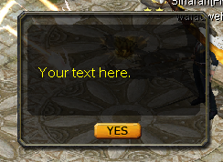
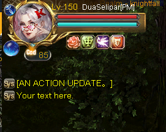
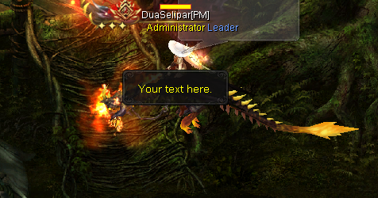

# 🧠 Eudemons Online `cq_action` Table Guide

Welcome to the ultimate guide for understanding the `cq_action` table used in Eudemons Online private servers. This table plays a critical role in controlling game behavior — from NPC dialogs and item rewards to experience gains, system messages, and conditional logic.

Whether you're new to EO development or looking to refine your scripting skills, this guide will walk you through:
- The purpose and structure of the `cq_action` table
- Common `type` codes and how they work
- Practical examples like giving items, showing NPC dialogs, and triggering system messages
- Tips for chaining actions using `id_next` and handling conditions with `id_nextfail`

All content is written clearly and includes real-world examples to help you build, debug, and expand your server’s functionality faster.

> ⚙️ Built by the EO dev community — for the EO dev community.

Explore the sections below and level up your EO server customization!

- [What is `cq_action`?](#what-is-cq_action)
- [Field Explanations](#field-explanations)
- [Common Action Types](#common-action-types)
- [Type Explaination Download](#download-full-action-types)
- [Action Type Guides](#action-type-guides)
- [Other Tools](#other-tools)

---

## What is `cq_action`?


The `cq_action` table controls sequences of actions triggered in-game — like when you click an NPC, receive an item, or complete a quest. It uses an ID-based flow system with support for conditions and multiple outcomes.

---

## Field Explanations


>```INSERT INTO `cq_action` (`id`, `id_next`, `id_nextfail`, `type`, `data`, `param`) VALUES (1000, 0000, 0000, 0501, 810007, '');```

| Field         | Description |
|---------------|-------------|
| `id`          | Unique action ID |
| `id_next`     | Next action if success/condition true |
| `id_nextfail` | Next action if condition fails |
| `type`        | Type of action (dialog, give item, etc.) |
| `data`        | Depends on type (item ID, message ID, etc.) |
| `param`       | Usually contains message text or command |

---

## Common Action Types

| Type Code | Description                  |
|-----------|------------------------------|
| `0101`    | NPC Dialog Text              |
| `0102`    | NPC Options (buttons)        |
| `0125`    | System Announcement (Global) |
| `0126`    | System Tip (Local)           |
| `501`     | Give Item                    |
| `1001`    | Give EXP, Money, Stones      |

---


## Download Full Action Types

You can download the full explanation of action types here.

- [Download Here](assets/ScriptTypeExplanation.txt)

---


## Action Type Guides

<div style="border-left: 6px solid #4CAF50; background: #f0fdf4; padding: 15px 20px; margin: 20px 0; border-radius: 6px; font-size: 15px; line-height: 1.6;">
  <strong style="display: inline-block; margin-bottom: 6px;">✅ Tip:</strong><br>
  <strong>Old Engine</strong> = 3-class system (2008)<br>
  ➤ Reference: 
  <a href="https://www.elitepvpers.com/forum/eo-pserver-guides-releases/191378-release-manequin-english-server-db-client-ready-use-one-link.html" target="_blank" style="color:#2e7d32; text-decoration:underline;">
    2008 Release (Mannequin DB)
  </a>
  <br><br>
  <strong>New Engine</strong> = 9-class system with new features (2022)<br>
  ➤ Reference:
  <a href="https://www.elitepvpers.com/forum/eo-pserver-guides-releases/5076188-release-version-1655-engine-celebrity-hall-divine-fire-statue.html" target="_blank" style="color:#2e7d32; text-decoration:underline;">
    2022 Release (v1655 Engine)
  </a>
</div>


<details>
  <summary>🗨️ <strong>Create Dialog (Type 101, 102, 104 and 120)</strong></summary>
  <br>

  <p>This action shows a dialog when the player interacts with an NPC or items.</p>
  

  <h4>💡 Example SQL:</h4>
  <pre>
REPLACE INTO `cq_action` VALUES (1001, 1002, 0000, 0101, 0, 'I can sell it only for an hour every day.');
REPLACE INTO `cq_action` VALUES (1002, 1003, 0000, 0101, 0, 'Do you want to give it a go?');
REPLACE INTO `cq_action` VALUES (1003, 1004, 0000, 0102, 0, 'Just~one,~please. 6960060');
REPLACE INTO `cq_action` VALUES (1004, 1005, 0000, 0102, 0, 'Sorry,~but~I~dont~need~it. 0');
REPLACE INTO `cq_action` VALUES (1005, 1006, 0000, 0104, 0, '0 0 34');
REPLACE INTO `cq_action` VALUES (1006, 0000, 0000, 0120, 0, '');
  </pre>

  <h4>📘 Explanation:</h4>
  <table style="width:100%; border-collapse:collapse;">
    <thead>
      <tr style="background:#f0f0f0;">
        <th style="text-align:left; padding:8px; border-bottom:1px solid #ccc;">Type</th>
        <th style="text-align:left; padding:8px; border-bottom:1px solid #ccc;">Purpose</th>
        <th style="text-align:left; padding:8px; border-bottom:1px solid #ccc;">param Explanation</th>
      </tr>
    </thead>
    <tbody>
      <tr>
        <td style="padding:8px;"><code>101</code></td>
        <td style="padding:8px;">Show dialog text</td>
        <td style="padding:8px;">NPC or item dialog string (maximum around 40 - 45 character each line)</td>
      </tr>
      <tr>
        <td style="padding:8px;"><code>102</code></td>
        <td style="padding:8px;">Dialog options / buttons</td>
        <td style="padding:8px;">Text task_id (use <code>0</code> for close); max 8 options, for text use ~ for spacing.</td>
      </tr>
      <tr>
        <td style="padding:8px;"><code>104</code></td>
        <td style="padding:8px;">Dialog image (face pic)</td>
        <td style="padding:8px;">x y pic_id — face index from <code>Ani/NpcFace.ANI</code> E.g - [Face34]</td>
      </tr>
      <tr>
        <td style="padding:8px;"><code>120</code></td>
        <td style="padding:8px;">End of dialog sequence</td>
        <td style="padding:8px;">(none)</td>
      </tr>
    </tbody>
  </table>
  <br>
</details>


<details>
  <summary>🎁 <strong>Sent Items (Type 501, 525, 540 and 550)</strong></summary>
  <br>

  <p>Sent the player a specific item when this action is triggered.</p>

  <h4>💡 Example SQL:</h4>
  <pre>
INSERT INTO `cq_action` VALUES (1000, 1002134, 0000, 0501, 754826, '');  
// For single items.

-- With custom stats (old engine)
INSERT INTO `cq_action` VALUES (1000, 0000, 0000, 0501, 1081990, '0 0 0 0 0 0 0 0 0 0 0 0 1');

-- Old engine param:
amount amount_limit ident gem1 gem2 magic1 magic2 magic3 data warghostexp gemtype availabletime MONOPOLY

-- With custom stats (new engine)
INSERT INTO `cq_action` VALUES (1000, 0000, 0000, 0501, 1081990, '0 0 0 0 0 0 0 0 0 0 0 0 1 0 0 0 0 0 0 0 0');

-- New engine param:
amount amount_limit ident gem1 gem2 magic1 magic2 magic3 data warghostexp gemtype availabletime MONOPOLY
eudemon_attack1 eudemon_attack2 eudemon_attack3 eudemon_attack4 special_effect Gem3 GodExp prescription

-- Usually used for equipment stat customization.
</pre>

  <h4>📌 Special Types (New Engine Only):</h4>

  <pre>
-- Type 525: Like 501, but availabletime becomes aging days.
INSERT INTO `cq_action` VALUES (1000, 0000, 0000, 0525, 820646, '0 0 0 0 0 0 0 0 0 0 0 30');
-- 30 = 30 days

-- Type 540: Modifies item count with logic
INSERT INTO `cq_action` VALUES (1000, 0000, 0000, 0540, 1020171, 'amount += 1');
-- Supports: <, >, <=, >=, =, += (can be negative to remove items). Only works with stackable items.

-- Type 550: Same as 501 but includes display effect
INSERT INTO `cq_action` VALUES (1000, 0000, 0000, 0550, 1600261, '');
-- Client-side effect shown below:
  </pre>

  

</details>


<details>
  <summary>⚙️ <strong>Modify Player Attributes (Type 1001)</strong></summary>
  <br>

  <p>This action modifies or checks player attributes using logic like <code>+=</code>, <code>==</code>, <code>&lt;</code>, etc.</p>

  <h4>💡 Example SQL:</h4>
  <pre>
INSERT INTO `cq_action` VALUES (1000, 0000, 0000, 1001, 0, 'e_money += 13500');  // add
INSERT INTO `cq_action` VALUES (1000, 0000, 0000, 1001, 0, 'e_money += -13500'); // remove
  </pre>

  <h4>📘 Supported Attributes & Operators:</h4>
  <div style="background:#f4f4f4; padding:12px 16px; border-radius:8px; font-size:14px; line-height:1.7; overflow:auto; max-height:500px;">
    <ul style="margin:0; padding-left:20px;">
      <li><code>life</code>, <code>mana</code>, <code>money</code>, <code>exp</code>, <code>pk</code> — <strong>(+=, ==, &lt;)</strong></li>
      <li><code>xp</code> — <strong>(+=)</strong></li>
      <li><code>profession</code> — <strong>(==, set, &gt;=, &lt;=)</strong></li>
      <li><code>level</code>, <code>force</code>, <code>dexterity</code>, <code>speed</code>, <code>health</code>, <code>soul</code> — <strong>(+=, ==, &lt;)</strong></li>
      <li><code>rank</code>, <code>rankshow</code> — <strong>(==, &lt;)</strong></li>
      <li><code>iterator</code> — <strong>(=, &lt;=, +=, ==)</strong></li>
      <li><code>crime</code> — <strong>(==, set)</strong></li>
      <li><code>gamecard</code>, <code>gamecard2</code> — <strong>(==, &gt;=, &lt;=)</strong></li>
      <li><code>metempsychosis</code> — <strong>(==, &lt;)</strong></li>
      <li><code>mercenary_rank</code>, <code>mercenary_exp</code>, <code>exploit</code> — <strong>(==, &lt;, +=)</strong></li>
      <li><code>maxlifepercent</code> — <strong>(+=, ==, &lt;)</strong></li>
      <li><code>tutor_exp</code>, <code>tutor_level</code> — <strong>(==, &lt;, +=, =)</strong></li>
      <li><code>eudemon_boord_size</code> — <strong>(==, &lt;, +=, =)</strong></li>
      <li><code>syn_proffer</code>, <code>maxeudemon</code>, <code>soul_value</code> — <strong>(&lt;, +=, =)</strong></li>
      <li><code>ahlife</code> — <strong>(-=)</strong></li>
      <li><code>moonmoney</code>, <code>starmoney</code> — <strong>(==, +=, &lt;&gt;)</strong></li>
      <li><code>BftitlePlaneid</code> — <strong>(==, +=, =)</strong></li>
      <li><code>DstitleId</code> — <strong>(==, &lt;)</strong></li>
      <li><code>crystalmoney</code>, <code>honourmoney</code>, <code>olggodmoney</code> — <strong>(+=, &lt;, ==)</strong></li>
      <li><code>energy</code> — <strong>(&lt;, +=, =)</strong></li>
      <li><code>goddesspoint</code> — <strong>(==, &lt;, +=)</strong></li>
      <li><code>godexp</code> — <strong>(+=, ==, &lt;)</strong></li>
      <li><code>exp_percent</code>, <code>godexp_percent</code> — <strong>(+=)</strong></li>
    </ul>
  </div>

  <p style="margin-top:12px;">🧠 Most attributes use <code>+=</code> to add, <code>==</code> to compare, and <code>&lt;</code> to check thresholds.</p>

  <div style="border-left: 4px solid #FF9800; background: #fff8e1; padding: 12px 16px; margin-top: 15px; border-radius: 6px;">
    ⚠️ <strong>Note:</strong> Only some attributes are available in the old engine.<br>
    Refer to your <code>cq_user</code> or <code>cq_user_new</code> table to verify which fields are available in your version.<br><br>
    📌 <strong>Old Engine:</strong> <code>cq_user</code><br>
    🆕 <strong>New Engine:</strong> <code>cq_user_new</code>
  </div>
</details>


<details>
  <summary>🎲 <strong>Random Chance & Random Action (Type 121 & 122)</strong></summary>
  <br>

  <p>These types allow you to introduce <strong>randomness</strong> into your server logic:</p>

  <ul>
    <li><strong>Type 121</strong> – Checks if a random chance is successful (e.g., 20% chance to win)</li>
    <li><strong>Type 122</strong> – Randomly selects and executes one of 8 possible actions</li>
  </ul>

  <h4>🎯 Type 121 – Random Chance</h4>
  <p><code>param</code> format: <code>"chance total"</code></p>
  <pre>
INSERT INTO cq_action VALUES (1000, 1001, 1002, 0121, 0, '20 100');
INSERT INTO cq_action VALUES (1001, 0000, 0000, 0126, 0, 'succeed');
INSERT INTO cq_action VALUES (1002, 0000, 0000, 0126, 0, 'fails');
  </pre>
  <p>This means: <strong>20 out of 100</strong> (20%) chance of success.</p>
  <ul>
    <li>If the check <strong>succeeds</strong>, it continues to <code>id_next</code> (1001)</li>
    <li>If the check <strong>fails</strong>, it continues to <code>id_nextfail</code> (1002)</li>
  </ul>

  <h4>🔀 Type 122 – Random Action Select</h4>
  <p><code>param</code> format: <code>"action0 action1 action2 ... action7"</code></p>
  <pre>
INSERT INTO cq_action VALUES (1000, 0000, 0000, 0122, 0, '1001 1002 1003 1004 1005 1006 1007 1008');
  </pre>
  <p>This means: randomly choose <strong>ONE</strong> action ID from the list above.<br>
Each ID must refer to a valid <code>cq_action</code> that will be executed.</p>

  <div style="border-left: 4px solid #FF9800; background: #fff8e1; padding: 12px 16px; margin-top: 16px; border-radius: 6px;">
    🧠 <strong>Tip:</strong> You can repeat the same ID multiple times to increase its chance of being selected.<br>
    Example: <code>'1001 1001 1001 1002 1002 1003 1004 1005'</code><br>
    This gives <code>1001</code> a higher weight than the others (appears 3 out of 8).
  </div>

  <div style="border-left: 4px solid #4CAF50; background: #e8f5e9; padding: 12px 16px; margin-top: 16px; border-radius: 6px;">
    💡 <strong>Use Case:</strong> 
    <code>type 121</code> is great for chance-based triggers (e.g. success/failure),
    while <code>type 122</code> is ideal for random branching events, rewards, or NPC reactions.
  </div>
</details>


<details>
  <summary>💬 <strong>Message Box (Type 126)</strong></summary>
  <br>

  <p><strong>Type 126</strong> displays a simple message box popup on the client with a <code>YES</code> button. It is for informational purposes only — it does <u>not</u> execute any action on click.</p>

  <h4>🖼️ Example Output:</h4>
  

  <h4>💡 Example SQL:</h4>
  <pre>
INSERT INTO cq_action VALUES (1000, 0000, 0000, 0126, 0, 'Your text here.');
  </pre>

  <h4>📌 Notes:</h4>
  <ul>
    <li><strong>param:</strong> The message to display. Spaces are allowed — you do <strong>not</strong> need to use <code>~</code>.</li>
    <li><strong>Text limit:</strong> Keep your message short and concise. Long messages will overflow or be cut off.</li>
    <li>Useful for showing warnings, notifications, or short instructions.</li>
  </ul>

</details>


<details>
  <summary>📢 <strong>Broadcast Message (Type 125)</strong></summary>
  <br>

  <p><strong>Type 125</strong> sends system-wide broadcast messages across different UI locations depending on the <code>data</code> value (channel type).</p>

  <h4>💡 Example SQL:</h4>
  <pre>
-- Top-left corner (Old & New Engine)
INSERT INTO cq_action VALUES (6000040, 0000, 0000, 0125, 2005, 'Your text here');

-- Center screen classic popup (Old & New Engine)
INSERT INTO cq_action VALUES (3508802, 0000, 0000, 0125, 2011, 'Your text here');

-- Bottom-left in chat (New Engine only)
INSERT INTO cq_action VALUES (201217028, 0000, 0000, 0125, 2007, 'Your text here');

-- Center screen modern popup (New Engine only)
INSERT INTO cq_action VALUES (25768045, 0000, 0000, 0125, 2024, 'Your text here');
  </pre>

  <h4>📸 Broadcast Styles:</h4>

  <table style="width:100%; border-collapse:collapse; font-size:14px;">
    <thead style="background:#f0f0f0;">
      <tr>
        <th style="text-align:left; padding:8px; border-bottom:1px solid #ccc;">Channel</th>
        <th style="text-align:left; padding:8px; border-bottom:1px solid #ccc;">Location</th>
        <th style="text-align:left; padding:8px; border-bottom:1px solid #ccc;">Preview</th>
        <th style="text-align:left; padding:8px; border-bottom:1px solid #ccc;">Engine</th>
      </tr>
    </thead>
    <tbody>
      <tr>
        <td style="padding:8px;"><code>2007</code></td>
        <td style="padding:8px;">Bottom-left (chat area)</td>
        <td style="padding:8px;"></td>
        <td style="padding:8px;">New Engine Only</td>
      </tr>
      <tr>
        <td style="padding:8px;"><code>2005</code></td>
        <td style="padding:8px;">Top-left system notice</td>
        <td style="padding:8px;"></td>
        <td style="padding:8px;">Old & New Engine</td>
      </tr>
      <tr>
        <td style="padding:8px;"><code>2024</code></td>
        <td style="padding:8px;">Modern popup (center screen)</td>
        <td style="padding:8px;"></td>
        <td style="padding:8px;">New Engine Only</td>
      </tr>
      <tr>
        <td style="padding:8px;"><code>2011</code></td>
        <td style="padding:8px;">Classic popup (center screen)</td>
        <td style="padding:8px;"></td>
        <td style="padding:8px;">Old & New Engine</td>
      </tr>
    </tbody>
  </table>

  <div style="border-left: 4px solid #4CAF50; background: #e8f5e9; padding: 12px 16px; margin-top: 16px; border-radius: 6px;">
    💡 <strong>Tip:</strong> Choose <code>data</code> based on how visible the message should be.<br>
    Use <code>2007</code> for chat-style messages, <code>2024</code> for clean centered alerts.
  </div>
</details>


<details>
  <summary>💡 <strong>Local System Message (Type 1010)</strong></summary>
  <br>

  <p><strong>Type 1010</strong> is used for sending client-side local messages, popups, and web links. The display behavior is defined by the <code>data</code> (channel) value.</p>

  <h4>💡 Example SQL:</h4>
  <pre>
-- Local chat system notice
INSERT INTO cq_action VALUES (1000, 0000, 0000, 1010, 2000, 'Your text here.');

-- Modern pop-up (new engine only)
INSERT INTO cq_action VALUES (1000, 0000, 0000, 1010, 2024, 'You`ve arrived in Forgotten Realms');

-- Web link
INSERT INTO cq_action VALUES (1000, 0000, 0000, 1010, 2105, 'http://www.google.com');
  </pre>

  <h4>📘 Message Channels (data values):</h4>

  <table style="width:100%; border-collapse:collapse; font-size:14px;">
    <thead style="background:#f0f0f0;">
      <tr>
        <th style="text-align:left; padding:8px; border-bottom:1px solid #ccc;">Data</th>
        <th style="text-align:left; padding:8px; border-bottom:1px solid #ccc;">Channel</th>
        <th style="text-align:left; padding:8px; border-bottom:1px solid #ccc;">Message Example</th>
      </tr>
    </thead>
    <tbody>
      <tr>
        <td style="padding:8px;"><code>2000/2007</code></td>
        <td style="padding:8px;">System Chat Channel</td>
        <td style="padding:8px;">Welcome to Knightfall.</td>
      </tr>
      <tr>
        <td style="padding:8px;"><code>2001</code></td>
        <td style="padding:8px;">Whisper Chat Channel</td>
        <td style="padding:8px;">Announcer: reminder has end.</td>
      </tr>
      <tr>
        <td style="padding:8px;"><code>2002</code></td>
        <td style="padding:8px;">[Action] Chat Channel</td>
        <td style="padding:8px;">Eliminate 16 Elite monsters.</td>
      </tr>
      <tr>
        <td style="padding:8px;"><code>2003</code></td>
        <td style="padding:8px;">Team Chat Channel</td>
        <td style="padding:8px;">%user_name has used Double EXP Potion.</td>
      </tr>
      <tr>
        <td style="padding:8px;"><code>2023</code></td>
        <td style="padding:8px;">Boss Chat Channel</td>
        <td style="padding:8px;">King MadBull has Appear!</td>
      </tr>  
       <tr>
        <td style="padding:8px;"><code>2025</code></td>
        <td style="padding:8px;">Help Chat Channel</td>
        <td style="padding:8px;">You don't have enough gold.</td>
      </tr>     
      <tr>
        <td style="padding:8px;"><code>2005</code></td>
        <td style="padding:8px;">Top-left Notice</td>
        <td style="padding:8px;">You learned Tornado Skill.</td>
      </tr>
      <tr>
        <td style="padding:8px;"><code>2011</code></td>
        <td style="padding:8px;">Center Screen - System</td>
        <td style="padding:8px;">You donated 1000 HP and the Hatred Wraith revived!</td>
      </tr>
      <tr>
        <td style="padding:8px;"><code>2024</code></td>
        <td style="padding:8px;">Modern Popup (New Engine)</td>
        <td style="padding:8px;">You’ve arrived in Cronus</td>
      </tr>
      <tr>
        <td style="padding:8px;"><code>2105</code></td>
        <td style="padding:8px;">Open Web Link</td>
        <td style="padding:8px;"><code>http://www.google.com</code></td>
      </tr>
    </tbody>
  </table>

  <h4>⚠️ Behavior Notes:</h4>
  <ul>
    <li><strong>All messages are local</strong> (only visible to the player)</li>
    <li><strong>data 2105</strong> will immediately open the provided web URL</li>
    <li>Text limits apply to some channels; keep messages concise</li>
  </ul>

  <div style="border-left: 4px solid #4CAF50; background: #e8f5e9; padding: 12px 16px; margin-top: 16px; border-radius: 6px;">
    💡 <strong>Tip:</strong> Use <code>type 1010</code> for immersive local feedback like quests, status effects, zone tips, or helper links — without global broadcast noise.
  </div>
</details>


---

## Other Tools

  - [Color Font Generator](color-generator.html)
  - [Cq_card Generator](cq_card-generator.html)

